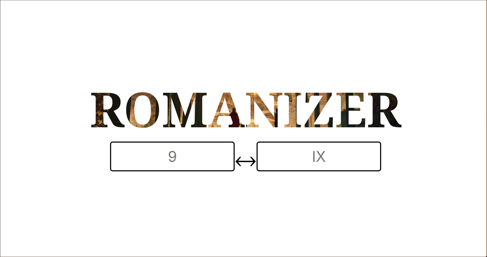
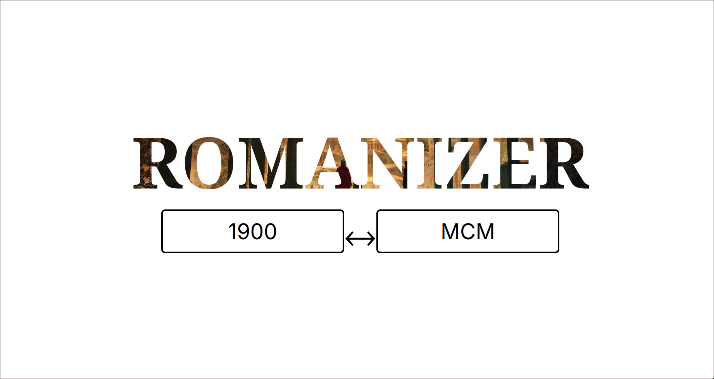
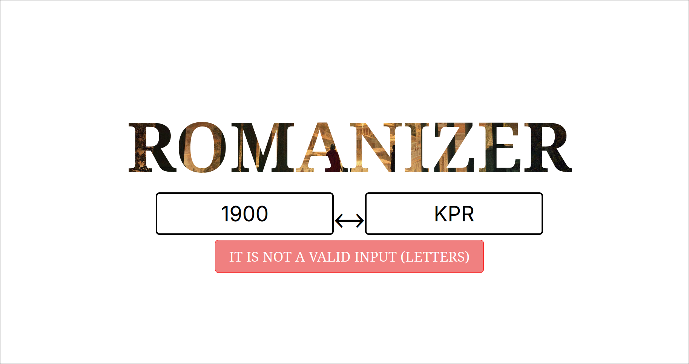

# Romanizer
- A simple app that displays a numerical number as Roman Numerals

# Installation
1. Clone the repository
2. Run `go build` or `go run ./cmd/main.go` 
3. Wait for the dependencies to be fully installed

# Running the application
1. Open the terminal and run `make server` and `make templ` separately
2. Open the application on your browser using the [url](https://localhost:7331/romanizer)

# Technologies I used:
1. [Go]()
2. [Go Fiber v3](https://docs.gofiber.io/next/) for the server
3. [Templ](https://templ.guide/) for the UI
4. [CSS](https://developer.mozilla.org/en-US/docs/Web/CSS) for styling the UI 

# References:
1. [Roman Numeral to Alpha Numeric Algorithm](https://freshman.tech/snippets/go/roman-numerals/)
2. [Alpha Numeric to Roman Numeral Algorithm](https://medium.com/@anuragsahani0123/roman-to-integer-solution-in-golang-22e156ebe7f9)
3. [Check if string contains only letters](https://stackoverflow.com/questions/38554353/how-to-check-if-a-string-only-contains-alphabetic-characters-in-go)

# Screenshots:

